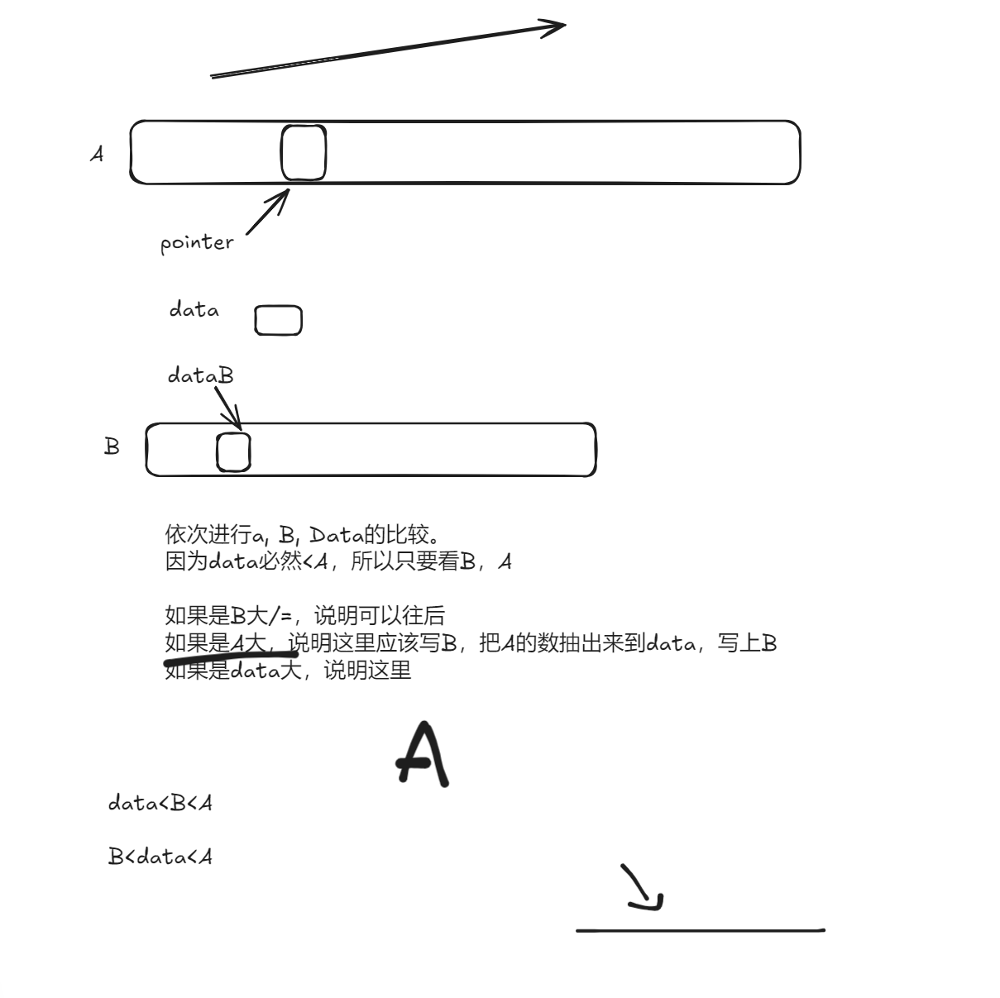

# Ans

错误的idea：

从前往后
此时需要copy，或者每次要更加复杂的比较。

good_sol.cpp

复杂度分析
时间复杂度:O(m+n)
空间复杂度:O(1)

https://leetcode.cn/problems/merge-sorted-array/solutions/84744/88-he-bing-liang-ge-you-xu-shu-zu-cc-by-bian-bian-